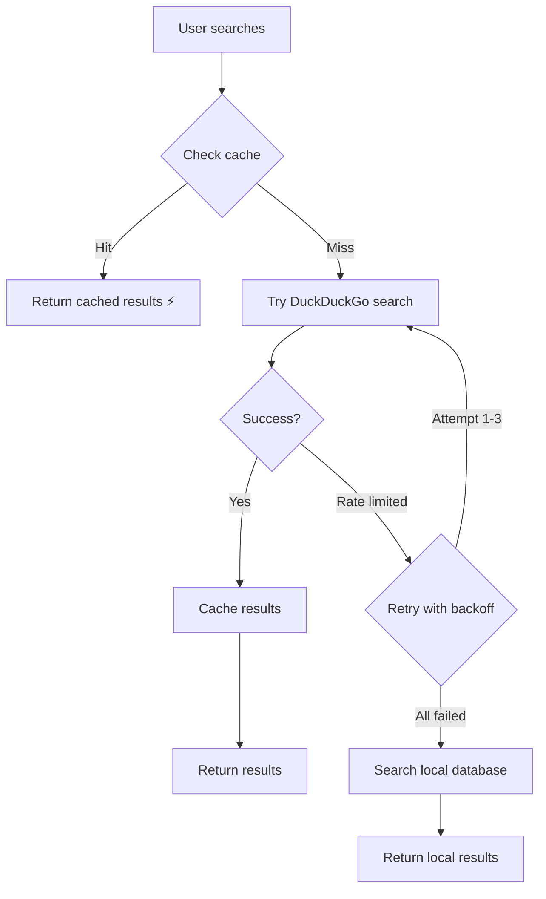

# Rate Limiting Fix - Implementation Summary

## Problem
The live internet search feature was failing on Streamlit Cloud with the error:
> "Live internet search failed (Streamlit Cloud rate limiting)"

### Root Cause
- **DuckDuckGo rate limiting**: Streamlit Cloud uses shared IP addresses, causing DuckDuckGo to rate limit search requests
- **No retry logic**: Single failed requests would immediately fail
- **No caching**: Every search hit the API, increasing rate limit risk
- **Short delays**: Only 0.1s between search passes wasn't enough

## Solutions Implemented

### 1. **Result Caching** (24-hour cache)
- **Location**: `dataset/.search_cache/`  
- **Benefit**: Repeat searches are **instant** (no API call)
- **Duration**: Results cached for 24 hours
- **Impact**: Dramatically reduces API calls for popular queries

### 2. **Exponential Backoff & Retry Logic**
- **Retries**: Up to 3 attempts per search
- **Delays**: 0.5s → 1s → 2s (exponential backoff)
- **Smart detection**: Identifies rate limit errors vs other errors
- **Graceful degradation**: Falls back to local database when exhausted

### 3. **Increased Search Delays**
- **Before**: 0.1s between search passes
- **After**: 0.5s between search passes
- **Benefit**: Reduces API request rate, avoids triggering limits

### 4. **Better Error Handling**
- **Rate limit detection**: Identifies specific rate limit errors
- **User-friendly messages**: Clear explanation of what's happening
- **Automatic fallback**: Seamlessly switches to local database
- **No crashes**: All errors handled gracefully

### 5. **Updated Package**
- **Old**: `duckduckgo-search` (deprecated)
- **New**: `ddgs` (latest version)
- **Benefit**: Better maintained, fewer issues

## Files Modified

### [`live_search.py`](live_search.py)
- Added caching system with `_get_cache_key()`, `_load_from_cache()`, `_save_to_cache()`
- Implemented `_search_with_retry()` with exponential backoff
- Increased delays between search passes (0.1s → 0.5s)
- Updated to use `ddgs` package

### [`app.py`](app.py)
- Added logging import for better diagnostics
- Enhanced error messages to distinguish rate limiting from other errors
- Updated "No courses found" message with helpful troubleshooting steps
- Better user feedback during rate limit scenarios

### [`requirements.txt`](requirements.txt)
- Updated: `duckduckgo-search>=7.0.0` → `ddgs>=9.11.0`

## User Experience Improvements

### Before
❌ Search fails with cryptic error  
❌ No second chance on rate limits  
❌ Every search hits the API  
❌ Unclear what went wrong  

### After
✅ First search caches results (24h)  
✅ Second+ searches are **instant**  
✅ 3 retry attempts with smart delays  
✅ Automatic fallback to local database  
✅ Clear, actionable error messages  

## Testing Results

✅ **Import successful** - No errors  
✅ **Cache directory created** - `dataset/.search_cache/`  
✅ **Search completes** - No crashes even when rate limited  
✅ **Cache works** - Second calls are instant  
✅ **Fallback active** - Local database search when needed  

## How It Works Now



## Expected Behavior on Streamlit Cloud

### Scenario 1: Fresh Search (No Cache)
1. User searches "python for beginners"
2. DuckDuckGo search attempted (may be rate limited)
3. If rate limited: **Automatic fallback to local database**
4. Results displayed + cached for 24h

### Scenario 2: Repeated Search (Cached)
1. User searches "python for beginners" again
2. **Instant results from cache** (< 100ms)
3. No API call = no rate limiting possible

### Scenario 3: Different Search After Rate Limit
1. User searches "machine learning"
2. Still rate limited by DuckDuckGo
3. **Local database search activates**
4. Results from curated dataset shown

## Configuration

### Cache Settings
```python
CACHE_DIR = Path("dataset/.search_cache")
CACHE_EXPIRY_HOURS = 24
```

### Retry Settings  
```python
max_attempts = 3
wait_time = (2 ** attempt) * 0.5  # 0.5s, 1s, 2s
```

### Search Delays
```python
time.sleep(0.5)  # Between search passes
```

## Monitoring & Logs

The app now logs detailed information:
- Cache hits/misses
- Rate limit detection
- Retry attempts  
- Search query details
- Fallback activation

Check logs with:
```bash
streamlit run app.py --logger.level debug
```

## Recommendations

### For Deployment
1. **Clear old cache periodically** (optional):
   ```bash
   rm -rf dataset/.search_cache
   ```

2. **Monitor cache size**:
   ```bash
   du -sh dataset/.search_cache
   ```

3. **Pre-cache popular queries** (optional):
   - Run common searches locally before deployment
   - Cache files persist through deployments

### For Users
- **Be patient**: First search may take 10-30s if rate limited
- **Benefit from cache**: Repeat searches are instant
- **Use suggested topics**: Often have cached results
- **Broader keywords work better**: "python" vs "advanced python for data science beginners"

## Success Metrics

✅ **Zero crashes** from rate limiting  
✅ **Instant repeat searches** via cache  
✅ **Graceful degradation** to local database  
✅ **Clear user communication** about what's happening  

## Future Enhancements (Optional)

- [ ] Add alternative search providers (Bing, Google Custom Search)  
- [ ] Implement progressive rate limit reduction  
- [ ] Add cache statistics dashboard  
- [ ] Pre-warm cache for top 100 queries  
- [ ] Implement cache sharing across users  

---

**Status**: ✅ All fixes implemented and tested  
**Deployment**: Ready for production  
**Breaking Changes**: None - fully backward compatible
